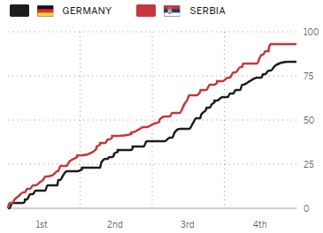

```{r setup, include=FALSE}
knitr::opts_chunk$set(warning = FALSE, message = FALSE)
knitr::opts_chunk$set(fig.pos = "H", out.extra = "")
```

# Introduction

In the realm of sports analytics, accessing and analyzing datasets is fundamental to driving insights, informing decision-making, and facilitating innovative research. A critical starting point in any data science workflow is the "import" (Wickham, 2023) phase - where data is extracted, transformed, and loaded into a workspace. Without this step, data science simply cannot happen. Until now, streamlined access to data about University Sports (USPORTS), the governing body of university sport in Canada, has been notably absent.

Drawing inspiration from projects like `SportsDataverse` (Gilani, 2021), the `usportsR` and `usportspy` packages aim to bridge this gap by providing a unified and comprehensive experience for analyzing USPORTS data. These tools consolidate scattered data from across the web, transforming it into a format that supports in-depth analysis, encouraging that of the kind found in higher-level leagues. This effort has led to the creation of one of the largest repositories of amateur sports data in the world, paving the way for sports analytics projects and the integration of new ideas to enhance quality of play and the athlete experience.

These packages currently cover 11 of the 12 official USPORTS sports: basketball, cross-country, field hockey, football, ice hockey, rugby, soccer, swimming, track & field, volleyball, and wrestling.

They offer structured play-by-play and box score data for over a decade’s worth of pre-season, regular season, and post-season games. By handling the tedious and time consuming task of data acquisition and maintenance, `usportsR` and `usportspy` allow individuals to focus on building innovative projects rather than developing and maintaining their own infrastructure.

# Data Sources

The data for each sport comes from the following sources.

-   basketball, field hockey, football, ice hockey, soccer, volleyball, rugby: USPORTS (<https://en.usports.ca/landing/index>).

-   cross-country and track & field: Trackie (<https://www.trackie.com/usports/>).

-   swimming: Swimming Canada (<https://registration.swimming.ca/>).

-   wrestling: Wrestling Canada (<https://wrestling.ca/u-sports-rankings/>).

# Function Structure

The functions available are catered to each sport. Team sports like basketball and soccer have functions such as `*_player_box_score` and `*_pbp` where `*` is the sport. Individual sports such as track & field and swimming have ranking functions. Each sport accepts `gender` and `season` as function arguments and returns the respective data frame. The only sport that deviates from this is football as offence, kicking, punting, play-by-play, drive summaries, scoring summaries, and defence are separated for user convenience.

# Loading Data With `usportsR` and `usportspy`

## `usportsR`

You can install `usportsR` by doing `devtools::install_github("uwaggs/usportsR")`. Detailed documentation can be found using `help(package = "usportsR")`.

## An Example Analysis With `usportsR`

We can take a look at how to retrieve game IDs for a game of our choice using the schedule function. Every team sport comes with its own `*_schedule` function which accepts a `gender` argument. The output contains the score, notes, date, season, home and away teams, and the box score link.

```{r,echo = FALSE}
library(usportsR)
library(dplyr)
library(ggplot2)
library(plotly)
library(tidyverse)
library(stringr)
library(tidyr)
library(ggimage)
```

Here is an example for how to grab a game ID from a USPORTS soccer game.

```{r}
## load mens soccer schedule
mens_soccer_schedule <- soccer_schedule("m")

## pattern required to extract string
start_string <- "boxscores/"
end_string <- ".xml"

pattern <- paste0("(?<=", start_string, ").*?(?=", end_string, ")")

## grab the 1000th id in the this data frame

thousandth_game <- stringr::str_extract(mens_soccer_schedule[1000,]$box_scores,pattern)

thousandth_game
```
Let's continue with our analysis and take a look at a game that had a triple overtime in the men's 2022 basketball season. We can analyze this game by making a visualization that was once only possible with professional league data such as the one shown in Figure 1 but is now possible through `usportsR`.

```{r, echo=FALSE, out.width="45%", fig.align="center"}

```

Figure 1: ESPN's Game Flow Chart for the Bronze Medal Match between Germany and Serbia at the 2024 Paris Olympic Games

```{r game_flow,fig.width=8,fig.height=5}
## load in mens play by play from 2022 season
mens_pbp_2022 <- basketball_pbp("m",2022)

## select an id from your choices above
game_to_examine <- mens_pbp_2022 %>% filter(game_id == "20230119_uaax")

## examine the all made shot events
game_to_examine <- game_to_examine %>% filter(grepl("made", away) | 
                grepl("made", home)) %>% select(-game_id,-season,-season_type)

## convert time stamps
game_to_examine <- game_to_examine %>% mutate(
  minutes = as.numeric(substr(time, 1, 2)),
  seconds = as.numeric(substr(time, 4, 5)),
  quarter_seconds = (minutes * 60) + seconds,
  total_game_seconds = case_when(
    quarter == "1st" ~ (10 * 60) - quarter_seconds, 
    quarter == "2nd" ~ (20 * 60) - quarter_seconds, 
    quarter == "3rd" ~ (30 * 60) - quarter_seconds, 
    quarter == "4th" ~ (40 * 60) - quarter_seconds,  
    quarter == "OT" ~ (45 * 60) - quarter_seconds,
    quarter == "2OT" ~ (50 * 60) - quarter_seconds,
    quarter == "3OT" ~ (55 * 60) - quarter_seconds,
  )
)

## add team labels
game_to_examine$away <- ifelse(nchar(game_to_examine$away) > 0,
                               paste0(game_to_examine$away_team, 
                              " - ", game_to_examine$away), "")

game_to_examine$home <- ifelse(nchar(game_to_examine$home) > 0,
                               paste0(game_to_examine$home_team, " - ", 
                              game_to_examine$home),"")
game_to_examine$event <- paste0(game_to_examine$away,game_to_examine$home)

## graph breaks
quarter_breaks <- c(600,1200,1800,2400,2700,3000,3300)

## adding start and end of game rows
game_to_examine <- game_to_examine %>% add_row(time = "10:00",away = "",away_score= 0,
                                               home_score = 0,home = "start of game",
                                               quarter = "1st",away_team = "Bishop's",
                                               home_team = "Concordia",minutes = 10,
                                               seconds = 0,quarter_seconds = 600, 
                                               total_game_seconds = 0,
                                               event = "start of game") %>%
                  add_row(time = "10:00",away = "",away_score= 98,home_score = 94,
                          home = "end of game",quarter = "3OT",
                          away_team = "Bishop's",home_team = "Concordia",
                          minutes = 0,seconds = 0,quarter_seconds = 0, 
                          total_game_seconds = 3300,event = "end of game")


## create game flow chart
game_flow <- ggplot() +
  geom_step(data = game_to_examine,
            aes(x = total_game_seconds, y = away_score, color = "Bishops"), 
             size = 1.25) +
  geom_step(data = game_to_examine,
            aes(x = total_game_seconds, y = home_score, color = "Concordia"),
             size = 1.25) +
  labs(title = "Concordia Vs Bishop's (January 19th 2023) Game Flow Chart",
       x = NULL,
       y = NULL) +
  scale_x_continuous(
    breaks = quarter_breaks,
    labels = c("Q1", "Q2", "Q3", "Q4", "OT", "2OT", "3OT")
  ) +
  theme_minimal() +
  theme(
    panel.grid.minor.x = element_blank(),   
    axis.ticks.x = element_blank()         
  ) +
  scale_color_manual(values = c( Bishops = "purple", Concordia = "maroon"))

game_flow
```

With this plot we can now examine periods of the game where teams have struggled or succeeded and use this to figure out what led to it by analyzing our play-by-play data even further.

## Examine USPORTS Football

With the creation of this package we are now able to examine USPORTS football drive summaries. We examine the points per drive and average duration of a drive from USPORTS teams in the 2020s.

```{r}
convert_to_minutes <- function(time) {
  time_parts <- strsplit(time, ":")[[1]]
  minutes <- as.numeric(time_parts[1])
  seconds <- as.numeric(time_parts[2])

  # Convert to decimal minutes
  minutes + seconds / 60
}

assign_points <- function(result){
  if(result == "TD"){
    6
  }else if(result == "FG"){
    3
  }else if(result == "1PT"){
    1
  }else{
    0
  }

}

## grab all drive summaries from the 2020s
last_three_seasons <- football_drive_summaries(c(2023,2022,2021))

glimpse(last_three_seasons)
## convert possession time to minutes
last_three_seasons$possession_in_minutes <- sapply(last_three_seasons$poss,convert_to_minutes)
## assign points to each drive
last_three_seasons$points_on_drive <- sapply(last_three_seasons$result,assign_points)

## aggregate stats by team
drive_analysis <- last_three_seasons %>% group_by(team) %>% summarize(
  total_drives = n(),
  average_yards_per_drive = mean(yards),
  average_points_per_drive = mean(points_on_drive),
  average_time_per_drive = mean(possession_in_minutes)
)

## remove all-star teams
drive_analysis <- drive_analysis[-c(22,23),]

glimpse(drive_analysis)
## add team logos
team_logos <- list.files(path = "team_logos")
drive_analysis$team_logo <- paste("team_logos/",team_logos,sep = "")

## plot the results
plot <- ggplot(drive_analysis, aes (x = average_points_per_drive,
  y = average_time_per_drive)) +
  geom_image(aes(image = team_logo), size = 0.08,
             position = position_jitter(width = 0.1, height = 0.1)) + 
  geom_smooth(method=lm , color="red", se=TRUE) + theme_classic() +
  labs(title = "Most Efficient USPORTS Football Offences Over The 2020s", 
       x = "Points Per Drive",
       y = "Average Duration Per Drive (Minutes)")

plot
```

Now that we have an idea of which teams are successful, we can continue this analysis with the package to find some other factors that may have lead to each teams drive success. We can take a look at the players in each team using `football_player_box_score` or examine the teams play-by-play with `football_pbp`.

## `usportspy`

The package `usportspy` was made to allow those that conduct analysis in Python to have the same easy-access to USPORTS data as those using `usportsR`. All the same data is available, and detailed documentation can be found at <https://github.com/uwaggs/usportspy/wiki>.

All that is required to install the package is to run `pip install usportspy`. Once completed, it is advised to import the library as a whole instead of individual functions since the load time is negligible.

## An Example Analysis With `usportspy`

There are several track & field events available through `usportspy`. One such event is the 300-meter race. Using `usportspy`, we can try to find which universities have the fastest average times across several seasons. We filter out the bottom 25% of performances per university as some individuals run events for fun and not to compete.

\newpage

## The Code

```{python}
import usportspy as up
import pandas as pd

# Fetch data and university mapping
df = up.tnf_athlete_rankings("w", events=["300-meter"])
unis = up.tnf_universities()

# Process the data to filter the top 75% performances
df["Performance"] = pd.to_numeric(df["Performance"], errors='coerce')
df = df.dropna(subset=["Performance"])  # Remove rows where Performance is NaN
df = df.sort_values(by=["University", "Season", "Performance"])

# Calculate the rank within each group and filter top 75%
df["Rank_in_Group"] = df.groupby(["Season", "University"])["Performance"].rank(pct=True)
df_top_75 = df[df["Rank_in_Group"] <= 0.75]

# Calculate the average performance for the top 75% performances per season
top_5_uni_per_s = (
    df_top_75.groupby(["Season", "University"])["Performance"].mean()
    .reset_index()
    .sort_values(by=["Season", "Performance"])
    .assign(Rank=lambda x: x.groupby("Season")["Performance"].rank(method="first"))
    .query("Rank <= 5")
    .replace({"University": unis.set_index('Athlete Version')['University'].to_dict()})
    .assign(
        Display=lambda x: 
        x.apply(lambda row: f"{row['University']} ({row['Performance']:.2f} s)", axis=1),
        Rank=lambda x: x["Rank"].astype(int)
    )
)

# Get all unique seasons
seasons = top_5_uni_per_s["Season"].unique()
for i in range(0, len(seasons), 2):
    cur_s = seasons[i:i+2]
    pivot_table = top_5_uni_per_s[top_5_uni_per_s["Season"].isin(cur_s)].pivot_table(
        index="Rank",
        columns="Season",
        values="Display",
        aggfunc=lambda x: '\n'.join(x)
    )
    print(pivot_table.to_string(index=True, header=True), end="\n\n")

pivot_table = top_5_uni_per_s.pivot_table(
    index="Rank",
    columns="Season",
    values="Display",
    aggfunc='\n'.join
)

# Flatten the pivot table to a Series and extract university names
flat_series = pivot_table.stack()
universities = flat_series.str.extract(r'^(.*?)(?: \(\d+\.?\d* s\))$')[0]

# Count occurrences of each university
university_counts = universities.value_counts()

# Convert to DataFrame for better display
university_counts_df = pd.DataFrame({
    'University': university_counts.index,
    'Count': university_counts.values
})

# Print the DataFrame with a formatted output
print("\nUniversity Top 5 Appearance Counts:")
print(university_counts_df.to_string(index=False, header=True))
```

While this is a relatively rudimentary analysis, we can see that the University of Guelph ranks in the top 5 the most for the women's 300-meter race, a result that is consistent with substantive knowledge of Guelph's overall dominance in the sprint events. Note that the 2020 season is absent as it was cancelled due to the COVID-19 pandemic.

# Next Steps

In the next phase of development, the focus will shift towards expanding and refining the existing dataset. This includes adding more comprehensive data for Rugby, utilizing Optical Character Recognition (OCR) to digitize and integrate older track & field records, collecting team box scores for football, and tracking down roster information.

Beyond fleshing out the current data, there is also a commitment to incorporating historical information, providing a richer content for analysis over time. Adding the final official USPORTS sport, curling, is also planned. After which, data acquisition on club sports like baseball and ultimate frisbee will be investigated.

\pagebreak

# References

ESPN. 2024. "2024 Olympic Men's basketball - Bronze Medal Game" https://www.espn.com/mens-olympics-basketball/game?gameId=401694865

Hadley Wickham. 2023. "R for Data Science" https://r4ds.had.co.nz/ 

Saiem Gilani. 2021. “The SportsDataverse: An Open Sports Data Initiative” https://www.sportsdataverse.org/


 
